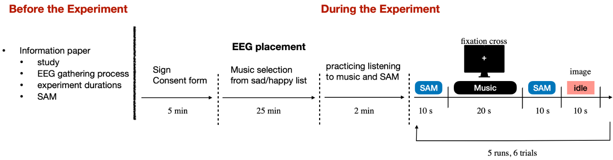

# ER-BCI: Music Emotion EEG Experiment

This repository contains the MATLAB/Psychtoolbox implementation of an EEG experiment that I developed for research on music, emotion, and affective brain-computer interfaces (aBCIs) at Otto von Guericke University Magdeburg.

The experiment was designed to study changes in participants' emotional states while listening to self-selected music. EEG was recorded during the experiment, and subjective emotional responses were collected using the Self-Assessment Manikin (SAM).

## Experiment overview

Participants selected music from happy and sad categories and completed multiple listening trials. Each trial included:

1. a SAM assessment of arousal and valence before listening;
2. music playback while the participant viewed a fixation cross;
3. a second SAM assessment after listening; and
4. a short idle period before the next trial.

The SAM interface used a nine-point scale for two emotional dimensions:

- **Valence:** unpleasant to pleasant
- **Arousal:** calm to excited

The broader aim of the study was to investigate EEG-based recognition of emotional state and its potential use in music recommendation for emotion regulation.

  

## Implementation

The experiment was implemented in MATLAB using [Psychtoolbox](https://psychtoolbox.org/). The repository includes scripts for:

- presenting experiment instructions and fixation crosses;
- selecting and playing music stimuli;
- collecting SAM arousal and valence ratings;
- controlling trial and block timing;
- storing participant and experiment information; and
- prototyping event markers through Lab Streaming Layer (LSL) and EEG trigger interfaces.

The main experiment script is [`music_experiment.m`](music_experiment.m). Supporting functions handle initialization, audio playback, visual presentation, SAM ratings, and trigger events.

## Repository note

This repository documents the experiment implementation and part of my research experience with EEG experiment design. It is shared as research material rather than as a maintained, ready-to-run software package. Local paths, stimulus files, audio-device settings, timing parameters, and trigger configuration may need to be adapted before the scripts can be run on another setup.

Participant-facing information about the study and experimental procedure is available in the [`BCI Information Sheet`](dataset/ethics/BCI_Information_Sheet.pdf).

## Author

Created by [Ayşe Betül Yüce](https://github.com/aysebetul).
